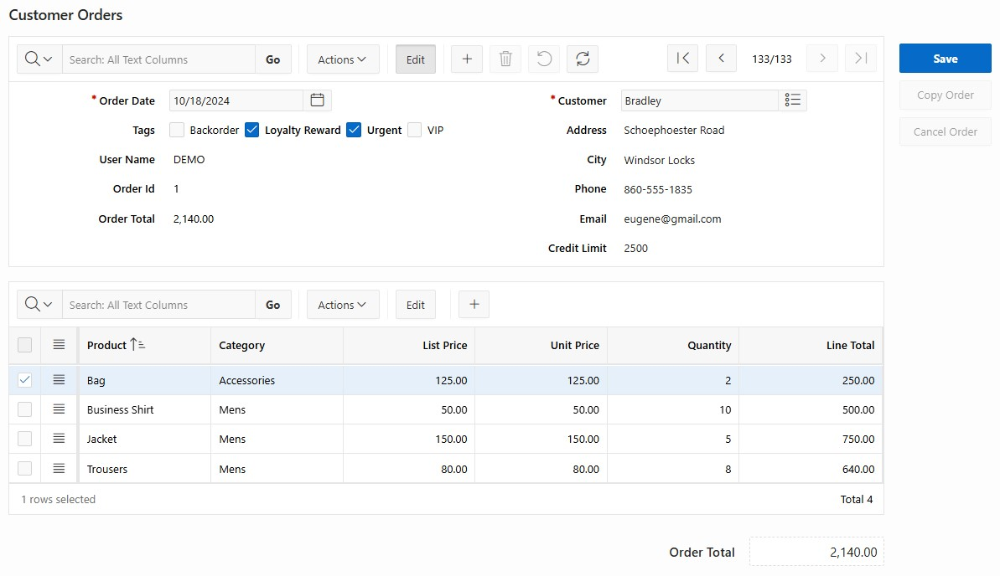

# apex-ig-single-row
Region plugin to render a single row of data in a simple form layout, enabling editing, navigating and refreshing data without page submits.

See this [blog item](https://karelekema.hashnode.dev/oracle-apex-ig-single-row-plugin) for an overview of the functionality.

<p>

</p>

In page designer, create a region and select the LIB4X - IG Single Row region type. The template can be 'Blank with Attributes'. In the plugin attributes, configure the layout and toolbar (buttons). Then, create an IG as a sub region:


and define the query, columns, column groups, etc. Configure the IG/Attributes/Edit/Enabled attribute: on or off. Next is an important step: in IG/Attributes/Initialization JavaScript Function, call the next plugin function:

```
function(config) {
    config = lib4x.axt.ig.singleRow.initIG(config);
    return config;
}
```

The regular [IG Single Row View options](https://docs.oracle.com/en/database/oracle/apex/24.2/aexjs/interactiveGrid.html#defaultSingleRowOptions) can also be configured here. For example:

```
function(config) {
    config = lib4x.axt.ig.singleRow.initIG(config);
    config.defaultSingleRowOptions = {
        alwaysEdit: true
    };
    return config;
}
```

Individual fields can be further programmatically configured as per the [field properties](https://docs.oracle.com/en/database/oracle/apex/24.1/aexjs/recordView.html#fields). For this, you can utilize the IG column JavaScript init func. For example when you want to configure your own layout using field column spans:

```
function(options) {
    options.defaultGridColumnOptions = {
        fieldColSpan: 2
    };
    return options;
}
```

Next classes can be used to reduce a field item width. Configure the class on the IG column, Advanced CSS classes.<br/>
* lib4x-form-field-width-25p
* lib4x-form-field-width-50p
* lib4x-form-field-width-75p

The plugin has the following public functions.

**lib4x.axt.ig.singleRow.masterDetailSaveCallServer** : can be used for the callserver in apex.model.save(). By using this callServer as a wrapper around the save request, it will prevent a 'Malformed response' error in case of applying Master-Detail referential integrity (Single Transaction). This as a workaround for a bug in APEX. The code replaces the original model id (eg 't1000') in the response with the server side generated id (insert situations).

**lib4x.axt.ig.singleRow.validate(igStaticId)** : can be used before save as to deal with the next issue: when in edit mode and hitting the save button, the event 'endrecordedit' won't fire and any (html5) validation errors won't populate into the model, from which it will execute the server call (and execute the server-side validations). In the validate function, the logic populates any validation errors into the model, so it will only go to the server when no open errors.

**lib4x.axt.ig.singleRow.gotoAnyError(igStaticId)** : function which can be used to jump to the first row having error(s). This can be errors in related detail records as well (master-detail setting).

**lib4x.axt.ig.singleRow.initIG(config)** : to be used in IG/Attributes/Initialization JavaScript Function (see above).

Also an event is exposed: **lib4x_ig_rv_update_actions**: will fire when the state of the toolbar buttons (powered by actions) is redetermined.

Below are examples codes as taken from the [demo page](https://oracleapex.com/ords/r/yola/demo/ig-single-row) (Customer Orders demo) in which the above functions and event are also illustrated.

Page - Function and Global Variable Declaration

```
(function($){ 
    apex.gPageContext$.on("apexreadyend", function(jQueryEvent) {
        apex.item('c_customer_id').loadingIndicator = function(lLoadingIndicator$){
            // this effectively prevents any loading indicator being shown upon
            // next/previous in edit mode (was causing flickering)
            return lLoadingIndicator$;
        };
        apex.item('c_product_id').loadingIndicator = function(lLoadingIndicator$){
            return lLoadingIndicator$;
        };
        let actions = apex.region('ig_order_header').call('getActions');
        let deleteRecord = actions.lookup('delete-record');
        let originalDeleteAction = deleteRecord.action;
        deleteRecord.action = function(event, focusElement, args) {
            let result = originalDeleteAction(event, focusElement, args);
            let singleRowView$ = apex.region('ig_order_header').call('getViews').grid.singleRowView$;
            singleRowView$.recordView('setEditMode', false);
            return result;
        };
        // workaround for bug in APEX in which callServer model option is not respected in case
        // of IG Save Action
        let origSave = apex.model.save;
        apex.model.save = function(requestData, options, modelId, includeRelated, callServer ) {
            if (modelId == 'ig_order_header_grid')
            {
                callServer = lib4x.axt.ig.singleRow.masterDetailSaveCallServer;
            }
            return origSave(requestData, options, modelId, includeRelated, callServer);
        };      
    });    
    $(function() {
        let region$ = $("#ig_order_header");    
        region$.on('lib4x_ig_rv_update_actions', function(event, data) {
            if (data.recordId)
            {
                let recMetadata = data.model.getRecordMetadata(data.recordId);
                recMetadata.inserted ? data.actions.enable('delete-record') : data.actions.disable('delete-record');
            }
        });   
    });         
})(apex.jQuery);

(function($){ 
    $(function(){    
        $('#ig_order_lines').on("interactivegridviewmodelcreate", function(jQueryEvent, data) { 
            let model = data.model;
            model.subscribe({
                onChange: function(changeType, change) {
                    if (changeType != 'destroy')
                    {
                        calculateOrderTotal(model);  
                    }   
                }
            });
        });
        $('#ig_order_lines').on("gridpagechange", function(jQueryEvent, data) { 
            let model = apex.region('ig_order_lines').call('getViews').grid.model;
            calculateOrderTotal(model);     
        });          
        function calculateOrderTotal(model)
        {
            let total = 0;
            model.forEach(function(record, index, id) {
                let lineTotal = apex.locale.toNumber(model.getValue(record, 'LINE_TOTAL'), model.getFieldMetadata('LINE_TOTAL').formatMask);
                let meta = model.getRecordMetadata(id);
                if (!isNaN(lineTotal) && !meta.deleted && !meta.agg){
                    total += lineTotal;
                }
            });  
            apex.item('P'+ apex.env.APP_PAGE_ID + '_ORDER_TOTAL').setValue(total);    
        }  
    });
})(apex.jQuery);
```

Save Button: on click event:

```
let singleRowView$ = apex.region('ig_order_header').call('getViews').grid.singleRowView$;
singleRowView$.recordView('instance').finishEditing().done(() => {
    // when in edit mode and hitting save button, no 'endrecordedit' 
    // use utility function to populate any html5 validations errors into the model
    lib4x.axt.ig.singleRow.validate('ig_order_header');
    apex.region('ig_order_header').call('getActions').invoke('save');
    lib4x.axt.ig.singleRow.gotoAnyError('ig_order_header');
});
```


